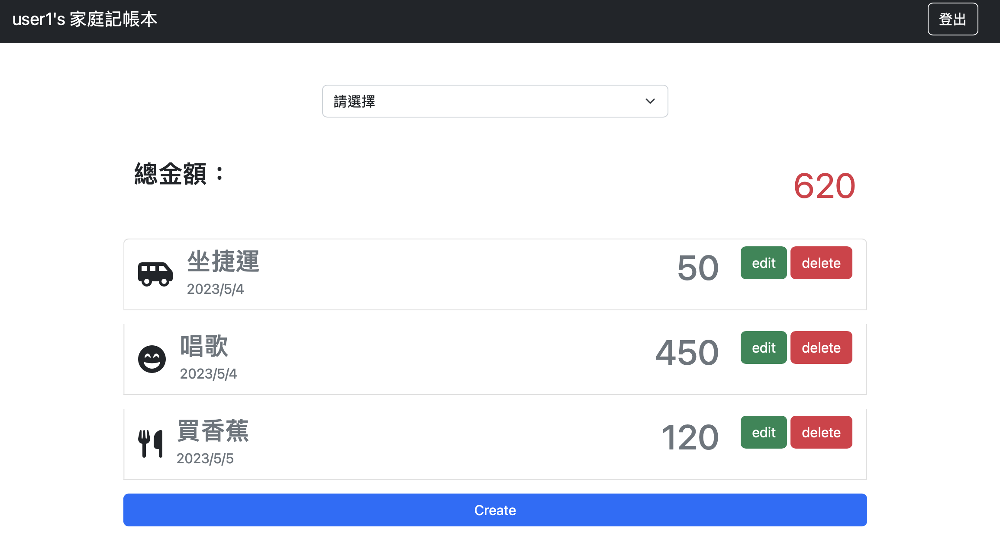
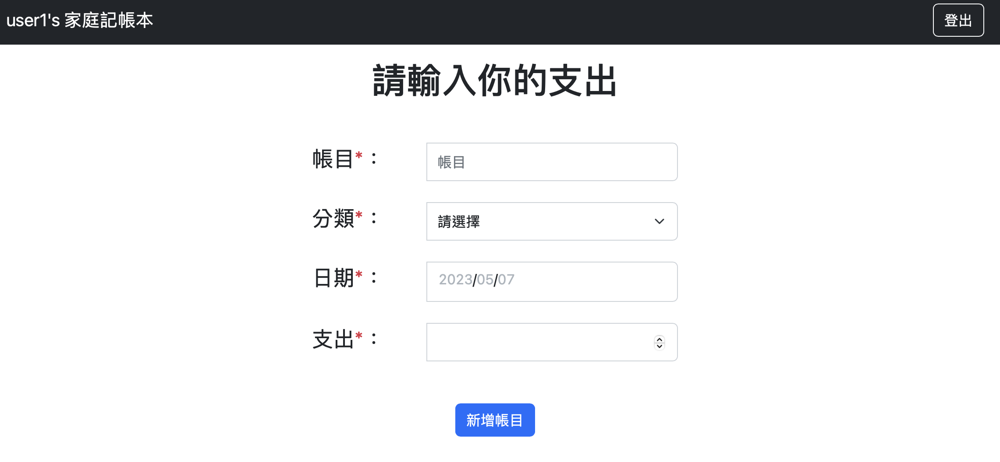
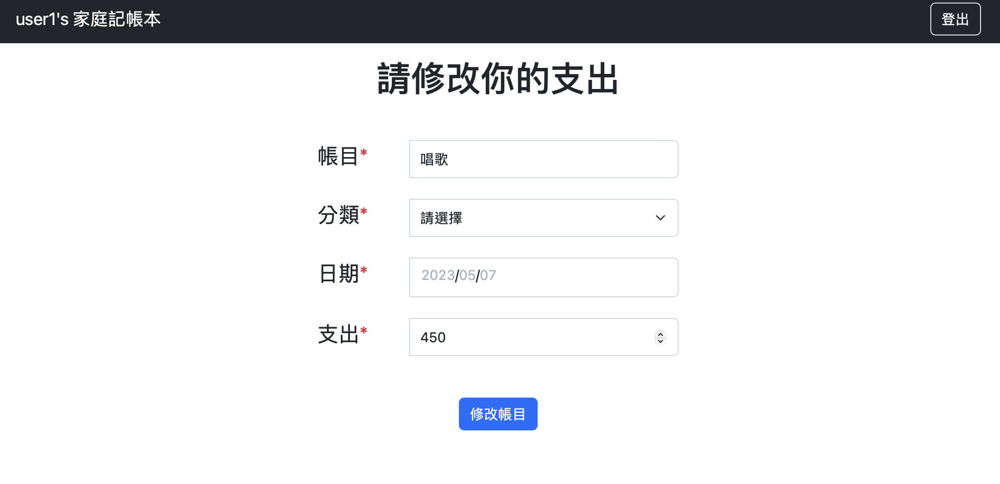

# 我的家庭記帳本



## 介紹

記錄自己的生活開支，可以新增、編輯自己的開支，並於首頁看到總支出。

### 功能

- 可使用facebook登入
- 查看所有開支

- 新增帳目

- 編輯帳目

- 刪除帳目

## 開始使用

1. 請先確認有安裝 node.js 與 npm
2. 使用git clone https://github.com/king610160/expense-track 至本地
3. 在本地開啟之後，透過終端機進入資料夾，輸入：

   ```bash
   npm install // 安裝套件
   ```

4. 設定環境變數，請參考env.example

   ```
   MONGODB_URL=mongodb+srv://<username>:<password>@<cluster>.pk4dwnp.mongodb.net/?retryWrites=true&w=majority
   ```

5. 寫入種子資料

   ```bash
   npm run seed
   ```

6. 啟動程式

   ```bash
   npm run dev
   ```

7. 若看見此行訊息則代表順利運行，打開瀏覽器進入到以下網址

   ```bash
   Expense-track is listening on localhost: http://localhost:3000
   ```

   請至 http://localhost:3000 開啟網站

8. 若欲中斷伺服器連線，請按

   ```bash
   ctrl + c
   ```


## 開發工具

- Node.js 14.16.0
- Express 4.18.2
- Express-Handlebars 4.0.6
- MongoDB
- Mongoose 7.1.
- Method-override 3.0.0
- Bcryptjs 2.4.3
- Connect-flash 0.1.1
- Express-session 1.17.3
- passport 0.4.1
- passport-facebook 3.0.0
- passport-local 1.0.0
- Font-awesome 5.8.1

